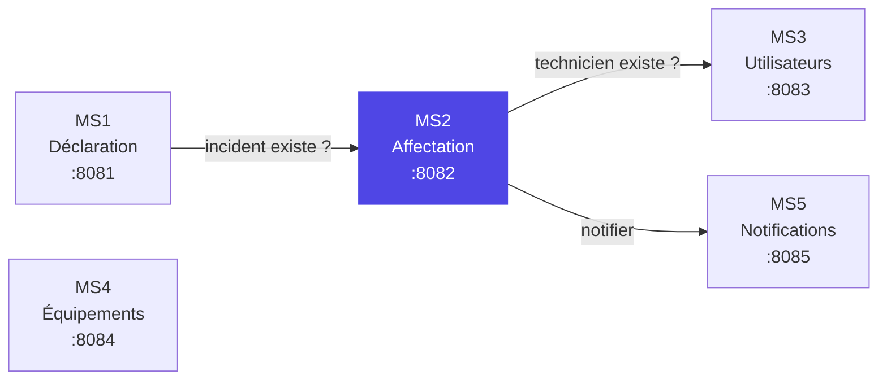
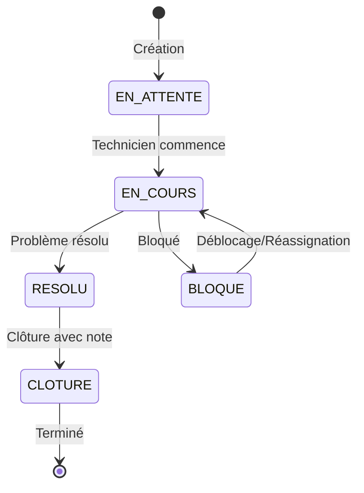
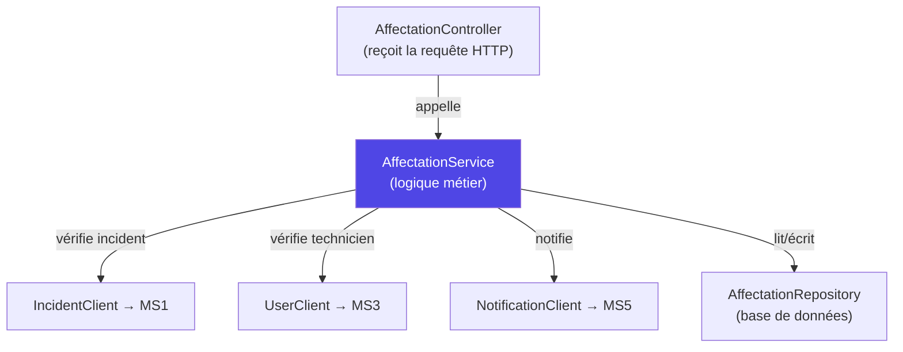
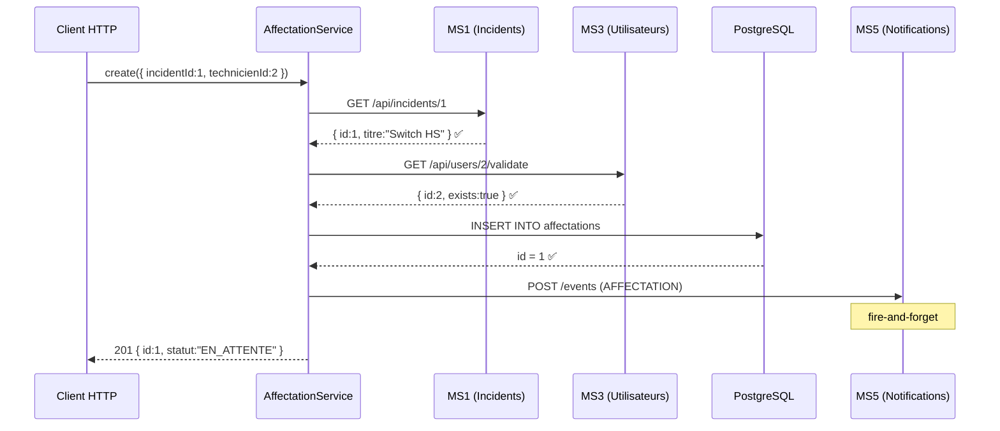
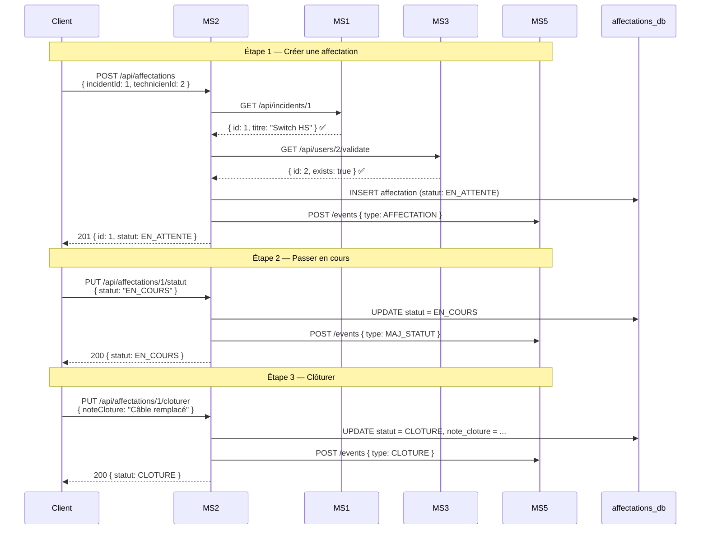

# MS2 — Affectation & Traitement : Walkthrough Complet

## Vue d'ensemble

Tu travailles sur un **système distribué de gestion des incidents IT** composé de 5 microservices. Ton microservice est **MS2 — Affectation & Traitement** : le cœur du workflow. Il reçoit un incident déjà déclaré (par MS1) et gère tout son cycle de vie — de l'affectation d'un technicien jusqu'à la clôture.



**Règle absolue :** Chaque service a sa propre base de données. Aucun accès direct aux tables d'un autre service — toute donnée passe par des **appels REST HTTP**.

---

## Structure du projet

```
Affectation-Et-Traitement/
├── pom.xml                          ← dépendances Maven
├── src/main/resources/
│   └── application.yaml             ← config (port, DB, URLs services)
└── src/main/java/
    ├── com/AffectationTraitement/
    │   └── AffectationEtTraitementApplication.java  ← point d'entrée
    └── com/incidents/ms2/affectation/
        ├── entity/                   ← les objets stockés en DB
        ├── repository/               ← accès à la DB (Spring Data JPA)
        ├── dto/                      ← objets de transfert (entrée/sortie API)
        ├── client/                   ← appels REST vers les autres services
        ├── service/                  ← logique métier
        ├── controller/               ← endpoints REST exposés
        ├── exception/                ← gestion d'erreurs
        └── config/                   ← configuration beans
```

---

## Résumé des fichiers (20 fichiers)

| # | Fichier | Couche | Rôle |
|---|---|---|---|
| 1 | `pom.xml` | Config | Dépendances Maven |
| 2 | `application.yaml` | Config | Port, DB, URLs services |
| 3 | `AffectationEtTraitementApplication.java` | Config | Point d'entrée Spring Boot |
| 4 | `RestTemplateConfig.java` | Config | Bean RestTemplate |
| 5 | `Affectation.java` | Entity | Table `affectations` |
| 6 | `StatutAffectation.java` | Entity | Enum des états |
| 7 | `AffectationRepository.java` | Repository | Requêtes DB |
| 8 | `AffectationRequest.java` | DTO | Body de création |
| 9 | `AffectationResponse.java` | DTO | Réponse API |
| 10 | `StatutUpdateRequest.java` | DTO | Body changement statut |
| 11 | `ClotureRequest.java` | DTO | Body clôture |
| 12 | `IncidentDto.java` | DTO | Réponse de MS1 |
| 13 | `ValidationResponse.java` | DTO | Réponse de MS3 |
| 14 | `NotificationEvent.java` | DTO | Envoyé à MS5 |
| 15 | `IncidentClient.java` | Client | Appels → MS1 |
| 16 | `UserClient.java` | Client | Appels → MS3 |
| 17 | `NotificationClient.java` | Client | Appels → MS5 |
| 18 | `AffectationService.java` | Service | Logique métier + machine à états |
| 19 | `AffectationController.java` | Controller | 6 endpoints REST |
| 20 | `GlobalExceptionHandler.java` | Exception | Erreurs → JSON propre |

---

## Configuration (fichiers 1–4)

#### [pom.xml](file:///d:/EMSI/S8/System%20distri/Projet/gestion-des-incidents-IT/Affectation-Et-Traitement/pom.xml)

> Le fichier Maven qui liste toutes les dépendances du projet.

| Dépendance | Rôle |
|---|---|
| `spring-boot-starter-web` | Serveur HTTP (Tomcat) + REST controllers |
| `spring-boot-starter-data-jpa` | ORM Hibernate pour lire/écrire en DB sans SQL manuel |
| `postgresql` | Driver JDBC pour se connecter à PostgreSQL |
| `springdoc-openapi-starter-webmvc-ui` | Génère automatiquement la doc Swagger UI |
| `spring-boot-starter-test` | Tests unitaires |

#### [application.yaml](file:///d:/EMSI/S8/System%20distri/Projet/gestion-des-incidents-IT/Affectation-Et-Traitement/src/main/resources/application.yaml)

> La configuration de l'application — port, DB, URLs des autres services.

#### [AffectationEtTraitementApplication.java](file:///d:/EMSI/S8/System%20distri/Projet/gestion-des-incidents-IT/Affectation-Et-Traitement/src/main/java/com/AffectationTraitement/AffectationEtTraitementApplication.java)

> Le point d'entrée `main()` de Spring Boot, avec `@EnableJpaRepositories` et `@EntityScan` pour que Spring trouve nos classes.

#### [RestTemplateConfig.java](file:///d:/EMSI/S8/System%20distri/Projet/gestion-des-incidents-IT/Affectation-Et-Traitement/src/main/java/com/incidents/ms2/affectation/config/RestTemplateConfig.java)

> Déclare le bean `RestTemplate` — le client HTTP partagé par tous les clients REST.

---

---

# FICHIERS DOMAINE — Explication détaillée

---

## A. Entity — `Affectation.java` (ce qu'on stocke en base de données)

[Ouvrir le fichier](file:///d:/EMSI/S8/System%20distri/Projet/gestion-des-incidents-IT/Affectation-Et-Traitement/src/main/java/com/incidents/ms2/affectation/entity/Affectation.java)

### Ce que ça fait
C'est la **classe qui correspond directement à une table** en base de données PostgreSQL. Chaque instance de `Affectation` = une ligne dans la table `affectations`.

### Le code, ligne par ligne

```java
@Entity                              // ① Dit à Hibernate : "cette classe = une table en DB"
@Table(name = "affectations")        // ② Le nom exact de la table dans PostgreSQL
public class Affectation {

    @Id                              // ③ Clé primaire
    @GeneratedValue(strategy = GenerationType.IDENTITY)  // ④ Auto-incrémentée par PostgreSQL
    private Long id;

    @Column(name = "incident_id", nullable = false)      // ⑤ Colonne obligatoire
    private Long incidentId;
    // ↑ C'est un simple nombre, PAS une clé étrangère. On ne peut pas
    //   faire de @ManyToOne car l'incident vit dans une AUTRE base (MS1).
    //   Pour vérifier qu'il existe, on appelle MS1 via REST.

    @Column(name = "technicien_id", nullable = false)
    private Long technicienId;
    // ↑ Pareil : simple Long. Le technicien vit dans MS3.

    @Column(name = "equipe_id")      // nullable (pas de `nullable = false`)
    private Long equipeId;           // ← optionnel, on peut affecter sans équipe

    @Enumerated(EnumType.STRING)     // ⑥ Stocke "EN_ATTENTE" comme texte, pas comme nombre
    @Column(name = "statut", nullable = false)
    private StatutAffectation statut = StatutAffectation.EN_ATTENTE;
    // ↑ Valeur par défaut : quand on crée une affectation, elle commence en EN_ATTENTE

    @Column(name = "date_affectation")
    private LocalDateTime dateAffectation = LocalDateTime.now();
    // ↑ Horodatage automatique à la création

    @Column(name = "date_fin")
    private LocalDateTime dateFin;   // ← null tant que pas clôturé

    @Column(name = "note_cloture", columnDefinition = "TEXT")
    private String noteCloture;      // ← commentaire libre à la clôture
    // columnDefinition = "TEXT" → PostgreSQL utilisera le type TEXT (pas VARCHAR 255)
}
```

### La table PostgreSQL correspondante (créée automatiquement)

```sql
CREATE TABLE affectations (
    id               BIGSERIAL PRIMARY KEY,   -- auto-incrémenté
    incident_id      BIGINT NOT NULL,          -- juste un nombre, pas FK
    technicien_id    BIGINT NOT NULL,          -- juste un nombre, pas FK
    equipe_id        BIGINT,                   -- peut être NULL
    statut           VARCHAR(255) NOT NULL,    -- stocke "EN_ATTENTE", "EN_COURS"...
    date_affectation TIMESTAMP,
    date_fin         TIMESTAMP,               -- NULL tant que pas fini
    note_cloture     TEXT                      -- commentaire libre
);
```

> [!IMPORTANT]
> **Pourquoi pas de clé étrangère (FK) ?** Parce que `incidentId` et `technicienId` font référence à des données dans d'**autres bases de données** (MS1 et MS3). PostgreSQL ne peut pas vérifier une FK vers une autre DB. C'est pour ça qu'on les valide par **appel REST** à la place.

---

## B. Entity — `StatutAffectation.java` (la machine à états)

[Ouvrir le fichier](file:///d:/EMSI/S8/System%20distri/Projet/gestion-des-incidents-IT/Affectation-Et-Traitement/src/main/java/com/incidents/ms2/affectation/entity/StatutAffectation.java)

### Ce que ça fait
Un `enum` Java qui contient les 5 états possibles d'une affectation. Utilisé avec `@Enumerated(EnumType.STRING)` dans l'entité pour que PostgreSQL stocke le texte lisible, pas un chiffre.

```java
public enum StatutAffectation {
    EN_ATTENTE,   // Affectation créée, technicien pas encore au travail
    EN_COURS,     // Technicien travaille activement dessus
    BLOQUE,       // Problème rencontré, avancement bloqué
    RESOLU,       // Travail terminé techniquement, en attente validation
    CLOTURE       // État terminal — c'est fini, archivé
}
```

### Les transitions autorisées (machine à états)



| De → | Vers | Quand |
|---|---|---|
| EN_ATTENTE | EN_COURS | Le technicien commence à travailler |
| EN_COURS | RESOLU | Le problème est résolu techniquement |
| EN_COURS | BLOQUE | Impossible d'avancer (manque pièce, accès...) |
| BLOQUE | EN_COURS | Le blocage est levé, ou réassignation |
| RESOLU | CLOTURE | Validation finale, on ferme le dossier |

> ❌ **EN_ATTENTE → RESOLU** : interdit — tu ne peux pas résoudre sans avoir travaillé dessus
> ❌ **CLOTURE → quoi que ce soit** : interdit — une fois clôturé, c'est terminé

---

## C. Clients REST — Communication avec les autres microservices

### C.1 — `IncidentClient.java` (appels vers MS1)

[Ouvrir le fichier](file:///d:/EMSI/S8/System%20distri/Projet/gestion-des-incidents-IT/Affectation-Et-Traitement/src/main/java/com/incidents/ms2/affectation/client/IncidentClient.java)

### Ce que ça fait
Quand on crée une affectation, on doit vérifier que l'incident existe vraiment dans MS1. Ce client fait un `GET` HTTP vers MS1.

### Le code, ligne par ligne

```java
@Component                           // ① Spring crée automatiquement une instance de cette classe
public class IncidentClient {

    private final String ms1Url;     // ② L'URL de MS1, ex: "http://localhost:8081"
    private final RestTemplate restTemplate;  // ③ Le client HTTP de Spring

    // ④ Injection par constructeur :
    //    @Value("${ms1.url}") → lit la valeur depuis application.yaml
    //    RestTemplate → injecté depuis RestTemplateConfig.java
    public IncidentClient(@Value("${ms1.url}") String ms1Url, RestTemplate restTemplate) {
        this.ms1Url = ms1Url;
        this.restTemplate = restTemplate;
    }

    public IncidentDto getIncident(Long id) {
        try {
            // ⑤ Fait un GET http://localhost:8081/api/incidents/42
            //    et convertit la réponse JSON en objet IncidentDto
            return restTemplate.getForObject(
                ms1Url + "/api/incidents/" + id, 
                IncidentDto.class
            );
        } catch (ResourceAccessException e) {
            // ⑥ ResourceAccessException = le serveur MS1 est injoignable
            //    (timeout, connexion refusée, DNS échoué...)
            //    On remonte une erreur 503 avec un message clair
            throw new ServiceUnavailableException(
                "MS1 (Déclaration) indisponible — réessayer plus tard"
            );
        }
    }
}
```

### Ce qui se passe concrètement

```
MS2 envoie :  GET http://localhost:8081/api/incidents/1
              ─────────────────────────────────────────→

MS1 répond :  200 OK
              {
                "id": 1,
                "titre": "Switch HS",
                "description": "Le switch du bureau 3 ne répond plus",
                "priorite": "HAUTE",
                "categorie": "Réseau",
                "statut": "OUVERT",
                "demandeurId": 1,
                "equipementId": 1
              }
              ←─────────────────────────────────────────

MS2 reçoit :  IncidentDto { id=1, titre="Switch HS", ... }
```

**Si MS1 est éteint :**
```
MS2 envoie :  GET http://localhost:8081/api/incidents/1
              ─────────────── ❌ Connection refused ───→

MS2 lance :   ServiceUnavailableException
              → GlobalExceptionHandler intercepte
              → Client reçoit : 503 { "message": "MS1 indisponible" }
```

---

### C.2 — `UserClient.java` (appels vers MS3)

[Ouvrir le fichier](file:///d:/EMSI/S8/System%20distri/Projet/gestion-des-incidents-IT/Affectation-Et-Traitement/src/main/java/com/incidents/ms2/affectation/client/UserClient.java)

### Ce que ça fait
Avant de créer une affectation, on vérifie que le technicien existe dans MS3. Ce client appelle l'endpoint `/validate` de MS3.

### Le code, ligne par ligne

```java
@Component
public class UserClient {

    private final String ms3Url;     // "http://localhost:8083"
    private final RestTemplate restTemplate;

    public UserClient(@Value("${ms3.url}") String ms3Url, RestTemplate restTemplate) {
        this.ms3Url = ms3Url;
        this.restTemplate = restTemplate;
    }

    public ValidationResponse validate(Long userId) {
        try {
            // Appelle : GET http://localhost:8083/api/users/2/validate
            return restTemplate.getForObject(
                ms3Url + "/api/users/" + userId + "/validate",
                ValidationResponse.class
            );
        } catch (ResourceAccessException e) {
            // MS3 est down → erreur 503
            throw new ServiceUnavailableException(
                "MS3 (Utilisateurs) indisponible — réessayer plus tard"
            );
        }
    }
}
```

### Ce qui se passe concrètement

```
MS2 envoie :  GET http://localhost:8083/api/users/2/validate
              ─────────────────────────────────────────────→

MS3 répond :  200 OK
              { "id": 2, "exists": true }
              ←─────────────────────────────────────────────

MS2 vérifie : exists == true ? → OK, on continue
              exists == false ? → ResourceNotFoundException (404)
```

> [!NOTE]
> L'endpoint `/validate` est un contrat entre les services. MS3 l'a créé spécifiquement pour que MS1 et MS2 puissent vérifier qu'un utilisateur existe sans récupérer toutes ses données. C'est un pattern courant en microservices.

---

### C.3 — `NotificationClient.java` (appels vers MS5)

[Ouvrir le fichier](file:///d:/EMSI/S8/System%20distri/Projet/gestion-des-incidents-IT/Affectation-Et-Traitement/src/main/java/com/incidents/ms2/affectation/client/NotificationClient.java)

### Ce que ça fait
À chaque action importante (affectation, changement de statut, clôture), MS2 envoie un **événement** à MS5 pour que celui-ci puisse créer un historique et envoyer des notifications.

### Le code, ligne par ligne

```java
@Component
public class NotificationClient {

    private final String ms5Url;     // "http://localhost:8085"
    private final RestTemplate restTemplate;

    public NotificationClient(@Value("${ms5.url}") String ms5Url, RestTemplate restTemplate) {
        this.ms5Url = ms5Url;
        this.restTemplate = restTemplate;
    }

    public void sendEvent(NotificationEvent event) {
        try {
            // POST http://localhost:8085/api/notifications/events
            // Body : { "type": "AFFECTATION", "incidentId": 1, "acteurId": 2 }
            restTemplate.postForObject(
                ms5Url + "/api/notifications/events", 
                event,       // ← Spring convertit l'objet Java en JSON automatiquement
                Void.class   // ← On ne s'attend pas à une réponse utile
            );
        } catch (Exception e) {
            // ⭐ DIFFÉRENCE CLÉ avec les 2 autres clients :
            //    On catch Exception (pas juste ResourceAccessException)
            //    Et on ne relance PAS d'exception — on log juste l'erreur.
            //
            //    POURQUOI ? Les notifications ne sont pas critiques.
            //    Si MS5 est down, on ne veut pas bloquer toute la création
            //    de l'affectation juste parce qu'on n'a pas pu notifier.
            //    C'est du "fire-and-forget" (envoyer et oublier).
            System.err.println("[MS2] Échec envoi notification MS5 — type=" 
                + event.getType() + " | " + e.getMessage());
        }
    }
}
```

> [!IMPORTANT]
> **Différence critique de stratégie d'erreur entre les 3 clients :**
> 
> | Client | Si le service est down... | Pourquoi |
> |---|---|---|
> | `IncidentClient` (MS1) | ❌ **Bloque** → erreur 503 | On ne peut pas créer une affectation sans vérifier que l'incident existe |
> | `UserClient` (MS3) | ❌ **Bloque** → erreur 503 | On ne peut pas affecter un technicien qui n'existe peut-être pas |
> | `NotificationClient` (MS5) | ✅ **Ne bloque pas** → log | Les notifications sont secondaires, le métier continue |

### Les 3 types d'événements envoyés par MS2

```json
// Quand on crée une affectation
{ "type": "AFFECTATION", "incidentId": 1, "acteurId": 2, "statut": null }

// Quand on change le statut
{ "type": "MAJ_STATUT", "incidentId": 1, "acteurId": 2, "statut": "EN_COURS" }

// Quand on clôture
{ "type": "CLOTURE", "incidentId": 1, "acteurId": 2, "statut": null }
```

---

## D. Service — `AffectationService.java` (le cœur du métier)

[Ouvrir le fichier](file:///d:/EMSI/S8/System%20distri/Projet/gestion-des-incidents-IT/Affectation-Et-Traitement/src/main/java/com/incidents/ms2/affectation/service/AffectationService.java)

### Ce que ça fait
C'est **le fichier le plus important de tout MS2**. Il contient toute la logique métier :
- Orchestration des appels vers les autres services
- Application des règles de gestion
- Validation de la machine à états
- Persistance en base de données

### Architecture : qui appelle qui ?



### Le constructeur — Injection de dépendances

```java
@Service   // ← Spring sait que c'est un composant de type "service métier"
public class AffectationService {

    // Les 4 dépendances dont ce service a besoin :
    private final AffectationRepository repository;      // accès DB
    private final IncidentClient incidentClient;         // appels vers MS1
    private final UserClient userClient;                 // appels vers MS3
    private final NotificationClient notificationClient; // appels vers MS5

    // Spring injecte automatiquement les 4 objets via le constructeur
    // (il les a trouvés grâce aux annotations @Repository, @Component, etc.)
    public AffectationService(AffectationRepository repository,
                              IncidentClient incidentClient,
                              UserClient userClient,
                              NotificationClient notificationClient) {
        this.repository = repository;
        this.incidentClient = incidentClient;
        this.userClient = userClient;
        this.notificationClient = notificationClient;
    }
```

---

### Méthode `create()` — Créer une affectation

C'est la méthode la plus riche. Elle suit **4 étapes** dans un ordre précis :

```java
public AffectationResponse create(AffectationRequest request) {

    // ══════════════════════════════════════════════════════════
    // ÉTAPE 1 : Vérifier que l'incident existe (appel HTTP → MS1)
    // ══════════════════════════════════════════════════════════
    IncidentDto incident = incidentClient.getIncident(request.getIncidentId());
    //                     └──── GET http://localhost:8081/api/incidents/1
    
    if (incident == null || incident.getId() == null) {
        throw new ResourceNotFoundException(
            "Incident #" + request.getIncidentId() + " introuvable dans MS1"
        );
        // → Le client reçoit : 404 { "message": "Incident #99 introuvable dans MS1" }
    }

    // ══════════════════════════════════════════════════════════
    // ÉTAPE 2 : Vérifier que le technicien existe (appel HTTP → MS3)
    // ══════════════════════════════════════════════════════════
    ValidationResponse validation = userClient.validate(request.getTechnicienId());
    //                              └──── GET http://localhost:8083/api/users/2/validate

    if (validation == null || !validation.isExists()) {
        throw new ResourceNotFoundException(
            "Technicien #" + request.getTechnicienId() + " introuvable dans MS3"
        );
        // → 404 { "message": "Technicien #99 introuvable dans MS3" }
    }

    // ══════════════════════════════════════════════════════════
    // ÉTAPE 3 : Sauvegarder en base de données
    // ══════════════════════════════════════════════════════════
    Affectation affectation = new Affectation();      // nouvel objet Java
    affectation.setIncidentId(request.getIncidentId());
    affectation.setTechnicienId(request.getTechnicienId());
    affectation.setEquipeId(request.getEquipeId());     // peut être null
    affectation.setStatut(StatutAffectation.EN_ATTENTE); // toujours EN_ATTENTE au début
    affectation.setDateAffectation(LocalDateTime.now()); // timestamp de maintenant

    Affectation saved = repository.save(affectation);
    //                  └──── Hibernate exécute :
    //                        INSERT INTO affectations (incident_id, technicien_id, ...)
    //                        VALUES (1, 2, ...)
    //                        RETURNING id;
    // "saved" contient maintenant l'objet avec l'id généré par PostgreSQL

    // ══════════════════════════════════════════════════════════
    // ÉTAPE 4 : Notifier MS5 (fire-and-forget, ne bloque pas)
    // ══════════════════════════════════════════════════════════
    notificationClient.sendEvent(NotificationEvent.builder()
            .type("AFFECTATION")                 // type d'événement
            .incidentId(saved.getIncidentId())   // quel incident
            .acteurId(saved.getTechnicienId())    // qui a été affecté
            .build());
    //     └──── POST http://localhost:8085/api/notifications/events
    //           Body : { "type": "AFFECTATION", "incidentId": 1, "acteurId": 2 }

    return toResponse(saved);  // convertit l'entité en DTO de réponse
}
```

#### Résumé visuel de `create()` :



---

### Méthode `updateStatut()` — Changer l'état

```java
public AffectationResponse updateStatut(Long id, StatutUpdateRequest request) {

    // 1. Récupérer l'affectation en DB (ou lancer 404)
    Affectation affectation = findOrThrow(id);
    //                        └──── SELECT * FROM affectations WHERE id = 1
    //                              Si rien trouvé → 404

    // 2. Vérifier que la transition est autorisée
    validateTransition(affectation.getStatut(), request.getStatut());
    //                  └──── ex: EN_ATTENTE → EN_COURS : ✅ OK
    //                        ex: EN_ATTENTE → RESOLU   : ❌ IllegalStateException (400)

    // 3. Appliquer le changement et sauvegarder
    affectation.setStatut(request.getStatut());
    Affectation saved = repository.save(affectation);
    //                  └──── UPDATE affectations SET statut = 'EN_COURS' WHERE id = 1

    // 4. Notifier MS5 (avec le nouveau statut)
    notificationClient.sendEvent(NotificationEvent.builder()
            .type("MAJ_STATUT")
            .incidentId(saved.getIncidentId())
            .acteurId(saved.getTechnicienId())
            .statut(saved.getStatut().name())   // ← "EN_COURS" en String
            .build());

    return toResponse(saved);
}
```

---

### Méthode `cloturer()` — Fermer une affectation

```java
public AffectationResponse cloturer(Long id, ClotureRequest request) {

    Affectation affectation = findOrThrow(id);

    // Empêcher de clôturer deux fois
    if (affectation.getStatut() == StatutAffectation.CLOTURE) {
        throw new IllegalStateException("Cette affectation est déjà clôturée.");
        // → 400 Bad Request
    }

    // Appliquer la clôture
    affectation.setStatut(StatutAffectation.CLOTURE);
    affectation.setNoteCloture(request.getNoteCloture());
    // Si dateFin est fournie dans la requête, on l'utilise. Sinon, maintenant.
    affectation.setDateFin(
        request.getDateFin() != null ? request.getDateFin() : LocalDateTime.now()
    );

    Affectation saved = repository.save(affectation);
    //                  └──── UPDATE affectations 
    //                        SET statut='CLOTURE', note_cloture='...', date_fin='...'
    //                        WHERE id = 1

    // Notifier MS5
    notificationClient.sendEvent(NotificationEvent.builder()
            .type("CLOTURE")
            .incidentId(saved.getIncidentId())
            .acteurId(saved.getTechnicienId())
            .build());

    return toResponse(saved);
}
```

---

### Méthode `validateTransition()` — La machine à états

```java
private void validateTransition(StatutAffectation from, StatutAffectation to) {
    // Switch expression Java 17+ — évalue chaque état source
    boolean valid = switch (from) {
        case EN_ATTENTE -> to == StatutAffectation.EN_COURS;
        //                 Seule transition autorisée: commencer le travail

        case EN_COURS   -> to == StatutAffectation.RESOLU 
                        || to == StatutAffectation.BLOQUE;
        //                 Soit on a fini, soit on est bloqué

        case BLOQUE     -> to == StatutAffectation.EN_COURS;
        //                 On reprend le travail (déblocage ou réassignation)

        case RESOLU     -> to == StatutAffectation.CLOTURE;
        //                 On confirme et on ferme

        case CLOTURE    -> false;
        //                 État terminal — plus rien n'est possible
    };

    if (!valid) {
        throw new IllegalStateException(
            "Transition invalide : " + from + " → " + to + ". " +
            "Autorisé : EN_ATTENTE→EN_COURS, EN_COURS→RESOLU|BLOQUE, BLOQUE→EN_COURS."
        );
        // → Le client reçoit 400 avec un message explicite
    }
}
```

### Exemples de scénarios valides et invalides :

| Requête `PUT /1/statut` | État actuel | Résultat |
|---|---|---|
| `{"statut":"EN_COURS"}` | EN_ATTENTE | ✅ 200 OK |
| `{"statut":"RESOLU"}` | EN_ATTENTE | ❌ 400 "Transition invalide" |
| `{"statut":"BLOQUE"}` | EN_COURS | ✅ 200 OK |
| `{"statut":"RESOLU"}` | EN_COURS | ✅ 200 OK |
| `{"statut":"EN_COURS"}` | BLOQUE | ✅ 200 OK |
| `{"statut":"EN_COURS"}` | CLOTURE | ❌ 400 "Transition invalide" |

---

### Méthode `toResponse()` — Conversion entité → DTO

```java
private AffectationResponse toResponse(Affectation a) {
    return AffectationResponse.builder()
            .id(a.getId())
            .incidentId(a.getIncidentId())
            .technicienId(a.getTechnicienId())
            .equipeId(a.getEquipeId())
            .statut(a.getStatut())
            .dateAffectation(a.getDateAffectation())
            .dateFin(a.getDateFin())
            .noteCloture(a.getNoteCloture())
            .build();
}
```

> **Pourquoi ne pas retourner l'entité directement ?** Parce que l'entité contient des annotations JPA, des mécanismes internes Hibernate, etc. Le DTO est un objet propre, découplé de la DB, qui ne contient que ce que le client doit voir.

---

## E. Controller — `AffectationController.java` (les endpoints REST)

[Ouvrir le fichier](file:///d:/EMSI/S8/System%20distri/Projet/gestion-des-incidents-IT/Affectation-Et-Traitement/src/main/java/com/incidents/ms2/affectation/controller/AffectationController.java)

### Ce que ça fait
C'est la **porte d'entrée HTTP** du service. Chaque méthode correspond à un endpoint REST. Le controller ne contient **aucune logique métier** — il délègue tout au `AffectationService`.

### Le code, annotation par annotation

```java
@RestController                      // ① Ce composant retourne du JSON (pas des pages HTML)
@RequestMapping("/api/affectations") // ② Préfixe commun de toutes les URLs
@Tag(name = "Affectations", ...)     // ③ Titre dans la page Swagger UI
public class AffectationController {

    private final AffectationService service;

    // Spring injecte le service automatiquement
    public AffectationController(AffectationService service) {
        this.service = service;
    }
```

### Endpoint 1 : `POST /api/affectations` — Créer

```java
    @PostMapping                     // POST sur /api/affectations
    @Operation(summary = "Créer une affectation", ...)  // doc Swagger
    public ResponseEntity<AffectationResponse> create(
            @RequestBody AffectationRequest request    // ← le body JSON est converti en objet Java
    ) {
        return ResponseEntity
                .status(HttpStatus.CREATED)            // 201, pas 200 (convention REST)
                .body(service.create(request));         // délègue au service
    }
```

**Requête :**
```bash
curl -X POST http://localhost:8082/api/affectations \
  -H "Content-Type: application/json" \
  -d '{"incidentId": 1, "technicienId": 2, "equipeId": 1}'
```

**Réponse 201 :**
```json
{
  "id": 1,
  "incidentId": 1,
  "technicienId": 2,
  "equipeId": 1,
  "statut": "EN_ATTENTE",
  "dateAffectation": "2026-04-12T11:42:00",
  "dateFin": null,
  "noteCloture": null
}
```

---

### Endpoint 2 : `GET /api/affectations` — Lister tout

```java
    @GetMapping
    public ResponseEntity<List<AffectationResponse>> getAll() {
        return ResponseEntity.ok(service.getAll());    // 200 OK
    }
```

---

### Endpoint 3 : `GET /api/affectations/{id}` — Détail

```java
    @GetMapping("/{id}")             // {id} est un paramètre d'URL
    public ResponseEntity<AffectationResponse> getById(
            @PathVariable Long id    // Spring extrait "id" de l'URL
    ) {
        return ResponseEntity.ok(service.getById(id));
        // Si id n'existe pas → ResourceNotFoundException → 404
    }
```

---

### Endpoint 4 : `PUT /api/affectations/{id}/statut` — Changer l'état

```java
    @PutMapping("/{id}/statut")
    public ResponseEntity<AffectationResponse> updateStatut(
            @PathVariable Long id,
            @RequestBody StatutUpdateRequest request
    ) {
        return ResponseEntity.ok(service.updateStatut(id, request));
    }
```

**Requête :**
```bash
curl -X PUT http://localhost:8082/api/affectations/1/statut \
  -H "Content-Type: application/json" \
  -d '{"statut": "EN_COURS"}'
```

---

### Endpoint 5 : `PUT /api/affectations/{id}/cloturer` — Clôturer

```java
    @PutMapping("/{id}/cloturer")
    public ResponseEntity<AffectationResponse> cloturer(
            @PathVariable Long id,
            @RequestBody ClotureRequest request
    ) {
        return ResponseEntity.ok(service.cloturer(id, request));
    }
```

**Requête :**
```bash
curl -X PUT http://localhost:8082/api/affectations/1/cloturer \
  -H "Content-Type: application/json" \
  -d '{"noteCloture": "Câble remplacé", "dateFin": "2026-04-17T14:30:00"}'
```

---

### Endpoint 6 : `GET /api/affectations/incident/{incidentId}` — Historique

```java
    @GetMapping("/incident/{incidentId}")
    public ResponseEntity<List<AffectationResponse>> getByIncident(
            @PathVariable Long incidentId
    ) {
        return ResponseEntity.ok(service.getByIncident(incidentId));
    }
```

> Retourne **toutes les affectations** liées à un incident donné. Utile si un incident a été réassigné plusieurs fois.

---

## F. Exception Handler — `GlobalExceptionHandler.java`

[Ouvrir le fichier](file:///d:/EMSI/S8/System%20distri/Projet/gestion-des-incidents-IT/Affectation-Et-Traitement/src/main/java/com/incidents/ms2/affectation/exception/GlobalExceptionHandler.java)

### Ce que ça fait
Intercepte toutes les exceptions lancées dans le code et les convertit en **réponses JSON propres** avec le bon code HTTP. Sans ça, Spring retournerait un gros stack trace illisible.

```java
@RestControllerAdvice   // ← Spring intercepte TOUTES les exceptions de tous les controllers
public class GlobalExceptionHandler {

    @ExceptionHandler(ResourceNotFoundException.class)   // intercepte cette exception spécifique
    public ResponseEntity<Map<String, Object>> handleNotFound(ResourceNotFoundException ex) {
        return ResponseEntity
                .status(HttpStatus.NOT_FOUND)            // 404
                .body(error(404, ex.getMessage()));
    }
```

### Exemples de réponses d'erreur :

````carousel
**404 — Ressource introuvable :**
```json
{
  "timestamp": "2026-04-12T11:42:00",
  "status": 404,
  "message": "Affectation #42 introuvable"
}
```
<!-- slide -->
**503 — Service distant down :**
```json
{
  "timestamp": "2026-04-12T11:42:00",
  "status": 503,
  "message": "MS1 (Déclaration) indisponible — réessayer plus tard"
}
```
<!-- slide -->
**400 — Transition invalide :**
```json
{
  "timestamp": "2026-04-12T11:42:00",
  "status": 400,
  "message": "Transition invalide : EN_ATTENTE → RESOLU. Autorisé : EN_ATTENTE→EN_COURS, EN_COURS→RESOLU|BLOQUE, BLOQUE→EN_COURS."
}
```
````

---

## Flux complet — Scénario bout en bout


