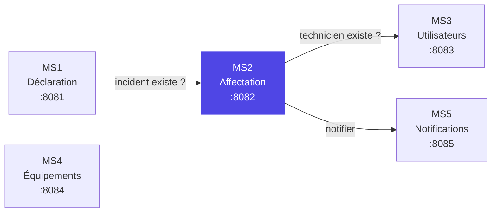
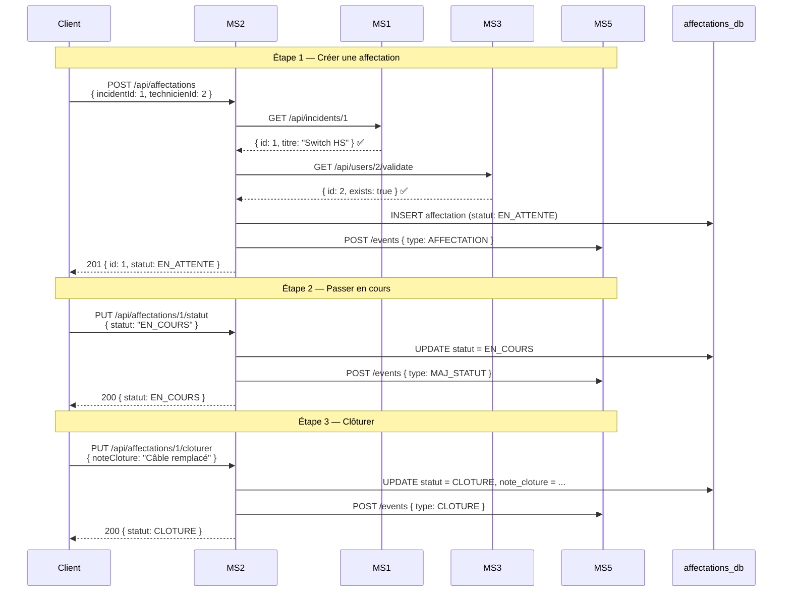

    # MS2 — Affectation & Traitement : Walkthrough Complet

## Vue d'ensemble

Tu travailles sur un **système distribué de gestion des incidents IT** composé de 5 microservices. Ton microservice est **MS2 — Affectation & Traitement** : le cœur du workflow. Il reçoit un incident déjà déclaré (par MS1) et gère tout son cycle de vie — de l'affectation d'un technicien jusqu'à la clôture.



**Règle absolue :** Chaque service a sa propre base de données. Aucun accès direct aux tables d'un autre service — toute donnée passe par des **appels REST HTTP**.

---

## Structure du projet

```
Affectation-Et-Traitement/
├── pom.xml                          ← dépendances Maven
├── src/main/resources/
│   └── application.yaml             ← config (port, DB, URLs services)
└── src/main/java/
    ├── com/AffectationTraitement/
    │   └── AffectationEtTraitementApplication.java  ← point d'entrée
    └── com/incidents/ms2/affectation/
        ├── entity/                   ← les objets stockés en DB
        ├── repository/               ← accès à la DB (Spring Data JPA)
        ├── dto/                      ← objets de transfert (entrée/sortie API)
        ├── client/                   ← appels REST vers les autres services
        ├── service/                  ← logique métier
        ├── controller/               ← endpoints REST exposés
        ├── exception/                ← gestion d'erreurs
        └── config/                   ← configuration beans
```

---

## Fichier par fichier

---

### 1. Configuration

#### [pom.xml](file:///d:/EMSI/S8/System%20distri/Projet/gestion-des-incidents-IT/Affectation-Et-Traitement/pom.xml)

> Le fichier Maven qui liste toutes les dépendances du projet.

| Dépendance | Rôle |
|---|---|
| `spring-boot-starter-web` | Serveur HTTP (Tomcat) + REST controllers |
| `spring-boot-starter-data-jpa` | ORM Hibernate pour lire/écrire en DB sans SQL manuel |
| `postgresql` | Driver JDBC pour se connecter à PostgreSQL |
| `springdoc-openapi-starter-webmvc-ui` | Génère automatiquement la doc Swagger UI |
| `spring-boot-starter-test` | Tests unitaires |

> [!NOTE]
> Lombok a été retiré car il est **incompatible avec JDK 25** (ton JDK). Tous les getters/setters sont écrits à la main.

---

#### [application.yaml](file:///d:/EMSI/S8/System%20distri/Projet/gestion-des-incidents-IT/Affectation-Et-Traitement/src/main/resources/application.yaml)

> La configuration de l'application.

```yaml
server.port: 8082                    # Port du service
spring.datasource.url: ...          # Connexion PostgreSQL → affectations_db
ms1.url: http://localhost:8081       # Où trouver MS1 (incidents)
ms3.url: http://localhost:8083       # Où trouver MS3 (utilisateurs)
ms5.url: http://localhost:8085       # Où trouver MS5 (notifications)
spring.jpa.hibernate.ddl-auto: update  # Crée/modifie les tables automatiquement
```

Les URLs (`ms1.url`, etc.) peuvent être remplacées par Docker Compose en production via des variables d'environnement.

---

#### [AffectationEtTraitementApplication.java](file:///d:/EMSI/S8/System%20distri/Projet/gestion-des-incidents-IT/Affectation-Et-Traitement/src/main/java/com/AffectationTraitement/AffectationEtTraitementApplication.java)

> Le point d'entrée — `main()` de Spring Boot.

```java
@SpringBootApplication(scanBasePackages = "com.incidents.ms2.affectation")
@EnableJpaRepositories(basePackages = "com.incidents.ms2.affectation.repository")
@EntityScan(basePackages = "com.incidents.ms2.affectation.entity")
```

- `@SpringBootApplication` → lance Spring Boot
- `scanBasePackages` → dit à Spring où chercher les classes (`@Service`, `@Controller`, etc.)
- `@EnableJpaRepositories` → dit à Spring Data JPA où chercher les interfaces repository
- `@EntityScan` → dit à Hibernate où chercher les entités `@Entity`

> [!IMPORTANT]
> Ces annotations sont nécessaires car la classe `main` est dans `com.AffectationTraitement` alors que tout le code métier est dans `com.incidents.ms2.affectation`. Sans elles, Spring ne trouverait rien.

---

### 2. Entity — Ce qu'on stocke en base de données

#### [Affectation.java](file:///d:/EMSI/S8/System%20distri/Projet/gestion-des-incidents-IT/Affectation-Et-Traitement/src/main/java/com/incidents/ms2/affectation/entity/Affectation.java)

> L'**entité JPA** qui correspond à la table `affectations` dans PostgreSQL.

| Champ | Type | Description |
|---|---|---|
| `id` | Long (auto) | Clé primaire |
| `incidentId` | Long | Référence vers l'incident dans MS1 (pas une FK réelle) |
| `technicienId` | Long | Référence vers le technicien dans MS3 |
| `equipeId` | Long | Référence vers l'équipe dans MS3 (optionnel) |
| `statut` | Enum | État actuel : EN_ATTENTE, EN_COURS, BLOQUE, RESOLU, CLOTURE |
| `dateAffectation` | DateTime | Quand l'affectation a été créée |
| `dateFin` | DateTime | Quand elle a été clôturée (null tant que pas fini) |
| `noteCloture` | Text | Commentaire libre à la clôture |

> [!IMPORTANT]
> `incidentId` et `technicienId` sont de simples `Long`, **pas des clés étrangères**. On ne peut pas faire de `@ManyToOne` entre deux bases de données différentes. Pour vérifier que l'incident ou le technicien existe, on fait un **appel REST**.

---

#### [StatutAffectation.java](file:///d:/EMSI/S8/System%20distri/Projet/gestion-des-incidents-IT/Affectation-Et-Traitement/src/main/java/com/incidents/ms2/affectation/entity/StatutAffectation.java)

> L'enum qui définit les états possibles d'une affectation.

```
EN_ATTENTE → EN_COURS → RESOLU → CLOTURE
                ↓          ↑
              BLOQUE ──────┘
```

- **EN_ATTENTE** : affectation créée, technicien pas encore au travail
- **EN_COURS** : technicien travaille dessus
- **BLOQUE** : problème, l'avancement est bloqué
- **RESOLU** : travail terminé, en attente de validation
- **CLOTURE** : état terminal, c'est fini

---

### 3. Repository — Accès à la base de données

#### [AffectationRepository.java](file:///d:/EMSI/S8/System%20distri/Projet/gestion-des-incidents-IT/Affectation-Et-Traitement/src/main/java/com/incidents/ms2/affectation/repository/AffectationRepository.java)

> Interface Spring Data JPA — **aucune implémentation à écrire**. Spring génère automatiquement le SQL.

```java
public interface AffectationRepository extends JpaRepository<Affectation, Long> {
    List<Affectation> findByIncidentId(Long incidentId);
}
```

Ce que tu obtiens gratuitement via `JpaRepository` :
- `save()` → INSERT ou UPDATE
- `findById()` → SELECT WHERE id = ?
- `findAll()` → SELECT *
- `deleteById()` → DELETE

La méthode `findByIncidentId()` est custom : Spring génère automatiquement `SELECT * FROM affectations WHERE incident_id = ?` juste à partir du nom de la méthode.

---

### 4. DTOs — Objets de transfert

> Les DTOs séparent ce que le client envoie/reçoit de ce qui est stocké en DB. C'est une bonne pratique pour ne pas exposer l'entité directement.

#### [AffectationRequest.java](file:///d:/EMSI/S8/System%20distri/Projet/gestion-des-incidents-IT/Affectation-Et-Traitement/src/main/java/com/incidents/ms2/affectation/dto/AffectationRequest.java)

> Ce que le client envoie pour **créer** une affectation.

```json
{
  "incidentId": 1,
  "technicienId": 2,
  "equipeId": 1
}
```

---

#### [AffectationResponse.java](file:///d:/EMSI/S8/System%20distri/Projet/gestion-des-incidents-IT/Affectation-Et-Traitement/src/main/java/com/incidents/ms2/affectation/dto/AffectationResponse.java)

> Ce que l'API **retourne** au client après chaque opération.

Contient un **builder** manuel pour construire l'objet lisiblement :
```java
AffectationResponse.builder()
    .id(1L)
    .incidentId(1L)
    .technicienId(2L)
    .statut(StatutAffectation.EN_ATTENTE)
    .build();
```

---

#### [StatutUpdateRequest.java](file:///d:/EMSI/S8/System%20distri/Projet/gestion-des-incidents-IT/Affectation-Et-Traitement/src/main/java/com/incidents/ms2/affectation/dto/StatutUpdateRequest.java)

> Pour changer l'état : `PUT /api/affectations/{id}/statut`

```json
{ "statut": "EN_COURS" }
```

---

#### [ClotureRequest.java](file:///d:/EMSI/S8/System%20distri/Projet/gestion-des-incidents-IT/Affectation-Et-Traitement/src/main/java/com/incidents/ms2/affectation/dto/ClotureRequest.java)

> Pour clôturer : `PUT /api/affectations/{id}/cloturer`

```json
{
  "noteCloture": "Câble remplacé, switch opérationnel",
  "dateFin": "2026-04-17T14:30:00"
}
```

---

#### [IncidentDto.java](file:///d:/EMSI/S8/System%20distri/Projet/gestion-des-incidents-IT/Affectation-Et-Traitement/src/main/java/com/incidents/ms2/affectation/dto/IncidentDto.java)

> Représente la réponse de MS1 quand on fait `GET /api/incidents/{id}`. On ne garde que les champs qui nous intéressent.

---

#### [ValidationResponse.java](file:///d:/EMSI/S8/System%20distri/Projet/gestion-des-incidents-IT/Affectation-Et-Traitement/src/main/java/com/incidents/ms2/affectation/dto/ValidationResponse.java)

> Réponse de MS3 sur `GET /api/users/{id}/validate` :

```json
{ "id": 2, "exists": true }
```

---

#### [NotificationEvent.java](file:///d:/EMSI/S8/System%20distri/Projet/gestion-des-incidents-IT/Affectation-Et-Traitement/src/main/java/com/incidents/ms2/affectation/dto/NotificationEvent.java)

> Ce qu'on envoie à MS5 via `POST /api/notifications/events` :

```json
{
  "type": "AFFECTATION",
  "incidentId": 1,
  "acteurId": 2,
  "statut": null
}
```

Types envoyés par MS2 : `AFFECTATION`, `MAJ_STATUT`, `CLOTURE`.

---

### 5. Clients REST — Appels vers les autres microservices

> Chaque client encapsule la communication avec un autre service. Ils utilisent `RestTemplate` (le client HTTP de Spring).

#### [IncidentClient.java](file:///d:/EMSI/S8/System%20distri/Projet/gestion-des-incidents-IT/Affectation-Et-Traitement/src/main/java/com/incidents/ms2/affectation/client/IncidentClient.java) → MS1

> Appelle `GET http://ms1:8081/api/incidents/{id}` pour vérifier que l'incident existe avant de créer une affectation.

Si MS1 est down → lance `ServiceUnavailableException` (réponse 503).

---

#### [UserClient.java](file:///d:/EMSI/S8/System%20distri/Projet/gestion-des-incidents-IT/Affectation-Et-Traitement/src/main/java/com/incidents/ms2/affectation/client/UserClient.java) → MS3

> Appelle `GET http://ms3:8083/api/users/{id}/validate` pour vérifier que le technicien assigné existe.

Si MS3 est down → lance `ServiceUnavailableException` (réponse 503).

---

#### [NotificationClient.java](file:///d:/EMSI/S8/System%20distri/Projet/gestion-des-incidents-IT/Affectation-Et-Traitement/src/main/java/com/incidents/ms2/affectation/client/NotificationClient.java) → MS5

> Envoie un événement à MS5 à chaque changement d'état.

**Fire-and-forget** : si MS5 est down, on log l'erreur mais on **ne bloque pas** l'opération principale. C'est un choix de design — les notifications ne sont pas critiques.

---

### 6. Service — La logique métier

#### [AffectationService.java](file:///d:/EMSI/S8/System%20distri/Projet/gestion-des-incidents-IT/Affectation-Et-Traitement/src/main/java/com/incidents/ms2/affectation/service/AffectationService.java)

> Le **cœur** de MS2. Contient toute l'intelligence du service.

**`create(request)`** — Créer une affectation :
1. Appelle MS1 → l'incident existe ? Sinon → erreur 404
2. Appelle MS3 → le technicien existe ? Sinon → erreur 404
3. Sauvegarde en DB avec statut `EN_ATTENTE`
4. Notifie MS5 (événement `AFFECTATION`)

**`updateStatut(id, request)`** — Changer l'état :
1. Récupère l'affectation en DB
2. **Valide la transition** via la machine à états (voir ci-dessous)
3. Met à jour en DB
4. Notifie MS5 (événement `MAJ_STATUT`)

**`cloturer(id, request)`** — Clôturer :
1. Vérifie que l'affectation n'est pas déjà clôturée
2. Passe en `CLOTURE`, enregistre la note et la date
3. Notifie MS5 (événement `CLOTURE`)

**`validateTransition(from, to)`** — Machine à états :

```java
EN_ATTENTE → EN_COURS         ✅
EN_COURS   → RESOLU | BLOQUE  ✅
BLOQUE     → EN_COURS         ✅ (réassignation)
RESOLU     → CLOTURE          ✅ (via /cloturer)
CLOTURE    → rien             ❌ (terminal)
```

Toute autre transition → erreur 400 avec message clair.

---

### 7. Controller — Les endpoints REST exposés

#### [AffectationController.java](file:///d:/EMSI/S8/System%20distri/Projet/gestion-des-incidents-IT/Affectation-Et-Traitement/src/main/java/com/incidents/ms2/affectation/controller/AffectationController.java)

> La couche qui expose l'API HTTP. Chaque méthode correspond à un endpoint.

| Méthode | Endpoint | Ce que ça fait | Code HTTP |
|---|---|---|---|
| `POST` | `/api/affectations` | Créer une affectation | 201 Created |
| `GET` | `/api/affectations` | Lister toutes les affectations | 200 OK |
| `GET` | `/api/affectations/{id}` | Détail d'une affectation | 200 OK |
| `PUT` | `/api/affectations/{id}/statut` | Changer le statut | 200 OK |
| `PUT` | `/api/affectations/{id}/cloturer` | Clôturer l'affectation | 200 OK |
| `GET` | `/api/affectations/incident/{incidentId}` | Historique d'un incident | 200 OK |

Les annotations `@Operation` et `@Tag` alimentent la page **Swagger UI** (`/swagger-ui.html`).

---

### 8. Exceptions — Gestion d'erreurs

#### [ResourceNotFoundException.java](file:///d:/EMSI/S8/System%20distri/Projet/gestion-des-incidents-IT/Affectation-Et-Traitement/src/main/java/com/incidents/ms2/affectation/exception/ResourceNotFoundException.java)

> Lancée quand une affectation, un incident ou un technicien n'est pas trouvé → réponse **404**.

#### [ServiceUnavailableException.java](file:///d:/EMSI/S8/System%20distri/Projet/gestion-des-incidents-IT/Affectation-Et-Traitement/src/main/java/com/incidents/ms2/affectation/exception/ServiceUnavailableException.java)

> Lancée quand MS1 ou MS3 est injoignable → réponse **503**.

#### [GlobalExceptionHandler.java](file:///d:/EMSI/S8/System%20distri/Projet/gestion-des-incidents-IT/Affectation-Et-Traitement/src/main/java/com/incidents/ms2/affectation/exception/GlobalExceptionHandler.java)

> Intercepte toutes les exceptions et les convertit en réponses JSON propres :

```json
{
  "timestamp": "2026-04-12T11:42:00",
  "status": 404,
  "message": "Affectation #42 introuvable"
}
```

| Exception | Code HTTP |
|---|---|
| `ResourceNotFoundException` | 404 |
| `ServiceUnavailableException` | 503 |
| `IllegalStateException` (transition invalide) | 400 |
| Toute autre exception | 500 |

---

### 9. Configuration

#### [RestTemplateConfig.java](file:///d:/EMSI/S8/System%20distri/Projet/gestion-des-incidents-IT/Affectation-Et-Traitement/src/main/java/com/incidents/ms2/affectation/config/RestTemplateConfig.java)

> Déclare le bean `RestTemplate` — le client HTTP partagé par tous les clients (IncidentClient, UserClient, NotificationClient).

---

## Flux complet — Scénario bout en bout



---

## Résumé des fichiers (20 fichiers)

| # | Fichier | Couche | Rôle |
|---|---|---|---|
| 1 | `pom.xml` | Config | Dépendances Maven |
| 2 | `application.yaml` | Config | Port, DB, URLs services |
| 3 | `AffectationEtTraitementApplication.java` | Config | Point d'entrée Spring Boot |
| 4 | `RestTemplateConfig.java` | Config | Bean RestTemplate |
| 5 | `Affectation.java` | Entity | Table `affectations` |
| 6 | `StatutAffectation.java` | Entity | Enum des états |
| 7 | `AffectationRepository.java` | Repository | Requêtes DB |
| 8 | `AffectationRequest.java` | DTO | Body de création |
| 9 | `AffectationResponse.java` | DTO | Réponse API |
| 10 | `StatutUpdateRequest.java` | DTO | Body changement statut |
| 11 | `ClotureRequest.java` | DTO | Body clôture |
| 12 | `IncidentDto.java` | DTO | Réponse de MS1 |
| 13 | `ValidationResponse.java` | DTO | Réponse de MS3 |
| 14 | `NotificationEvent.java` | DTO | Envoyé à MS5 |
| 15 | `IncidentClient.java` | Client | Appels → MS1 |
| 16 | `UserClient.java` | Client | Appels → MS3 |
| 17 | `NotificationClient.java` | Client | Appels → MS5 |
| 18 | `AffectationService.java` | Service | Logique métier + machine à états |
| 19 | `AffectationController.java` | Controller | 6 endpoints REST |
| 20 | `GlobalExceptionHandler.java` | Exception | Erreurs → JSON propre |
